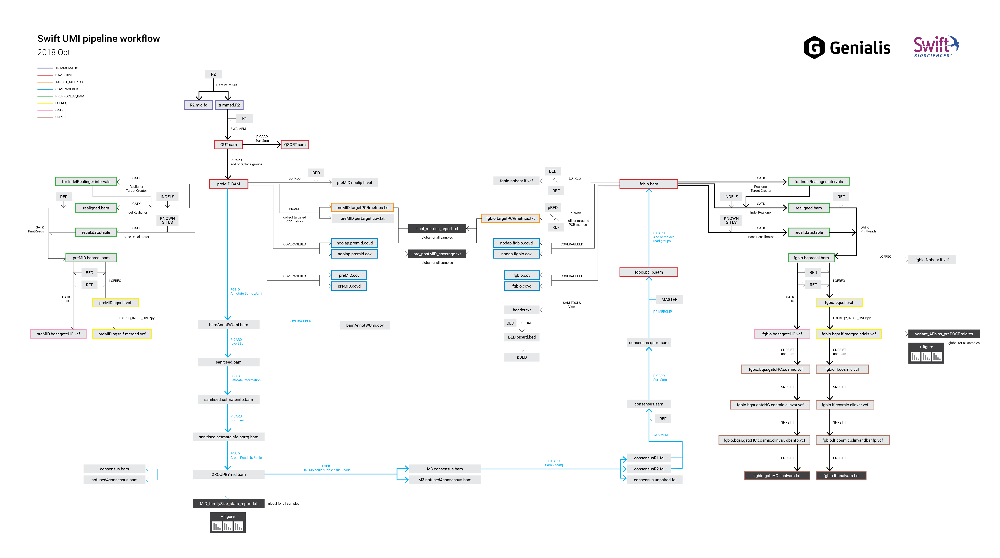

# Swift  Amplicon HS Panel with UMI pipeline

This is a pipeline which handles samples tagged with unique molecular identifiers 
([Swift  Amplicon HS Panel with UMI](https://swiftbiosci.com/products/new-swift-amplicon-hs-panels/)).
It differs from the forked repository by including as many tools as possible from docker
images hosted on DockerHub as well as packing R functions for plotting.

Tools are run in a docker container (spawned from docker image) with links to databases, including the
folder where original samples are located. A command is sent to each docker container through a string
using `docker exec` command.

The script is made out of three parts.
* run pipeline on samples
* run quality check and produce tables and figures
* bundle result into a `.zip` file

Sample files should be located in the same folder as the script. Results will be written to the same folder.

To run the pipeline, make sure the file is executable on your machine (use `chmod`). To run it, use 
`./umi_swift_local_pipeline.sh`. See script for steps taken.

Once all the steps have completed, some statistics are produced and summarized using 
`mid_QC_module.sh` script (which can be run _post festum_ using `./mid_QC_module.sh`). Output includes
some tables (`variant_AFbins_prePOST-MID.txt`, `MID_FamilySize_Stats_report.txt`) and figures
 (`Figure1_family_size_histogram.pdf`, `Figure2_variant_AFbins_prePOST-MID.pdf`).
 
Finally a `report.zip` bundle is produced from a selected subset of files.

## Workflow visualization
A graphical representation of the workflow. Blue lines depict the added part to handle UMIs. Thick black lines is the
currently implemented SwiftBio pipeline implemented in 
[`resolwe-bio`](https://github.com/genialis/resolwe-bio/blob/master/resolwe_bio/processes/workflows/amplicon.yml). Colored
lines around results indicate which process from `resolwe-bio` is used to create it (e.g. 
[`bwa_trim`](https://github.com/genialis/resolwe-bio/blob/master/resolwe_bio/processes/amplicon/bwa_trim.yml),
[`trimmomatic`](https://github.com/genialis/resolwe-bio/blob/master/resolwe_bio/processes/reads_processing/trimmomatic.yml)...).

(click to download)
